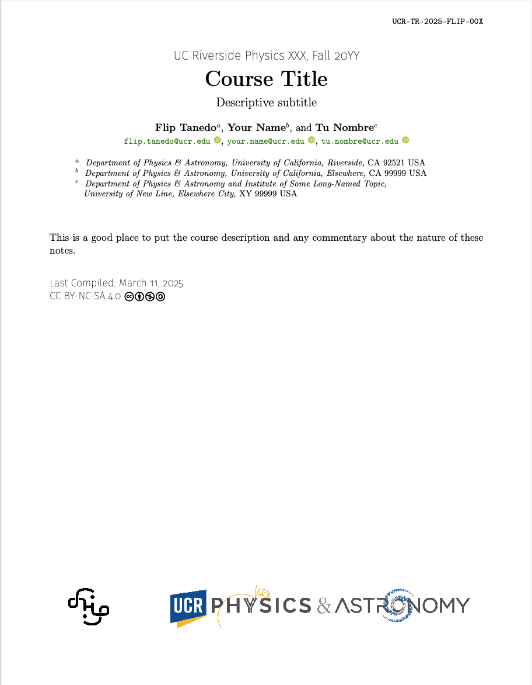
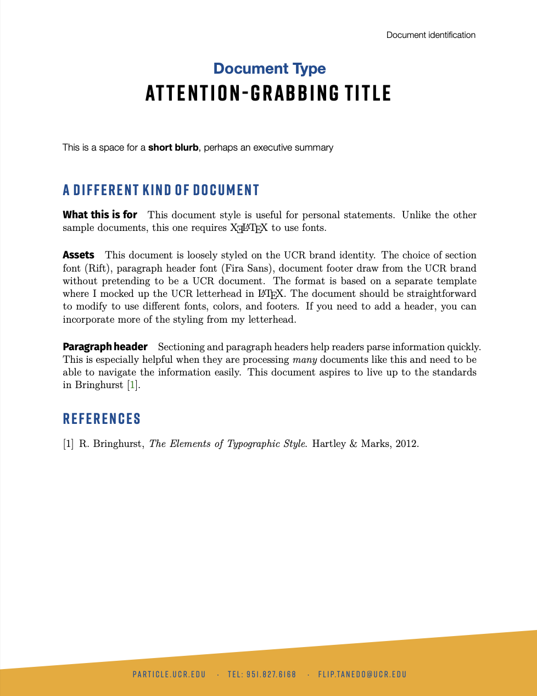

# Flip's Paper Template 2025

https://github.com/fliptanedo/paper-template-2025

A LaTeX paper template that I use for papers and notes. Replaces [2022 version](https://github.com/fliptanedo/paper-template-2022), [2021 version](https://github.com/fliptanedo/flip-paper-template-2021) and [even older version](https://github.com/fliptanedo/flip-paper-template).

By Flip Tanedo (flip.tanedo@ucr.edu)

License: CC BY-NC-SA 4.0
https://creativecommons.org/licenses/by-nc-sa/4.0/deed.en


## Quick Start

### Using this template: Overleaf

If you have the Overleaf premium account, you can use Git to synchronize with an Overleaf copy of your project. The simplest way (for me) to use this with Overleaf is to

1. create a stub Overleaf document
2. use Git to clone it locally
3. manually transfer the template files 
4. prune excess files (e.g. samples)
5. check the `.gitignore` file (might have to rename `gitignore.txt`)
6. push back to Overleaf

### Using this template

1. Go to repo's [page]( https://github.com/fliptanedo/paper-template-2025) on GitHub.

2. Click on the green **Use this template** button and select **Create a new repository**. This is a nice feature of *template* repositories: you can create new repositories that are not connected to the template. This is in contrast to *forking* a repository, which has the implication of later suggesting that your edits should be merged back into the main branch.

3. Follow the directions to create a new repository. Suppose you call it `NEW-REPO-NAME`. You may want to make it private if you're writing some top secret paper. Once you have created a new repository, click on the green **Code** button and copy the GitHub CLI code. It should look something like
   ```
   gh repo clone fliptanedo/NEW-REPO-NAME
   ```

4. Navigate a terminal window to the folder in which you would like to clone the `NEW-REPO-NAME` GitHub  repository, Paste the above `gh` code and execute it. This assumes that you have the [GitHub CLI](https://cli.github.com) installed.

5. Your new paper and local git repository is all set to go. 

### Sample files

* `sample_paper.tex` is a standard manuscript
  
  
* `sample_shortnote.tex` is for a brief note 
  
* `sample_lecturenotes.tex` is for a long set of lecture notes
  
* `sample_nicedocument.tex` is for reports, applications
  

### Usage Notes

* Place figures in the `\figures` directory. 
* The template files are in `FlipTemplate\`, you should not have to edit these directly. 
* Modify the `FlipAdditionalHeader.tex` with any new header items (packages, etc.).   You can clean out the parts that are there for the sample files only.
* There is a `gitignore.txt` file that is a copy of `.gitignore`. This is here simply because `.gitignore` is invisible to the Finder graphical unser interface in macOS. Sometimes you might lose it if you are using Finder to copy and paste.
* The sample files use 


## How to use this (old)

For those, like me, are less competent with `git` and GitHub than we really aught to be.

1. Go to repo's [page]( https://github.com/fliptanedo/paper-template-2022) on GitHub.

2. Click on the green `Code` button just to the top-right of the list of files. 

3. Copy the GitHub Command Line Interface (CLI) code:

   ```
   gh repo clone fliptanedo/paper-template-2025
   ```

4. Locally (on your system) go to the parent directory of where you'd like to start a new LaTeX project and open a Terminal (command prompt) window there. Assuming you have `git` set up, you can simply type in

   ```
   gh repo clone fliptanedo/paper-template-2025
   ```

5. and press enter.

6. This should create a new folder `paper-template-2025`. Go ahead and rename it right away:

   ```
   mv paper-template-2025 new-folder-name
   ```

7. Go ahead and start your new project.


## Other packages used

I include these files in this repository. They are in the `./FlipTemplate/` subfolder. The `./FlipTemplate/FlipPreamble.tex` and `./FlipTemplate/FlipPreambleEnd.tex` calls them assuming that they are in this subfolder.

* [Jacques Distler's](https://golem.ph.utexas.edu/~distler/TeXstuff/)  `utcaps.bst` 
* [AAS TeX](https://ui.adsabs.harvard.edu/help/actions/journal-macros)'s  `aas_macros.sty`
* [Leo Stein's](https://ctan.org/pkg/orcidlink?lang=en)  `orcidlink.sty`
* [Benjamin Bayart's](https://ctan.org/pkg/undertilde) `undertilde.sty`; note that you have to recompile this yourself if you want a fresh install.

## References
* https://github.com/joaomlourenco/novathesis/blob/main/novathesis.cls
* https://github.com/fmarotta/kaobook
* https://practicaltypography.com
* [AIP Style Guide](https://publishing.aip.org/wp-content/uploads/2021/03/AIP_Style_4thed.pdf)

## Work to be done
* Convert `lecturenotes` sample to KOMA script. See inspiration by [Ken Arroyo Ohori's thesis](https://3d.bk.tudelft.nl/ken/en/2016/04/17/a-1.5-column-layout-in-latex.html), implemented as [kaobook](https://github.com/fmarotta/kaobook) ([latextemplates](https://www.latextemplates.com/template/kaobook))